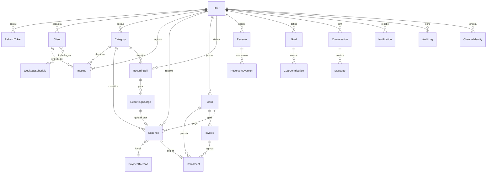

# 03 — Modelo de Domínio (ER)

> Diagrama lógico. O schema executável está em `prisma/schema.prisma` e comentado em
> `docs/04-prisma-schema.md`. Todo modelo tem `id`, `createdAt`, `updatedAt`, `deletedAt` (soft delete).

## Diagrama ER (Mermaid)

## Entidades principais

### User (tenant)
Raiz de todo dado. Todo registro pertence a um `userId`. Auth por e-mail/senha (bcrypt).

### ChannelIdentity
Vincula o usuário a um canal externo (ex.: `telegram:123456789`). Permite achar o tenant a
partir de uma mensagem recebida. Um usuário pode ter vários canais.

### Client
Cliente do autônomo (Maria, João, Empresa XYZ). Campos: nome, telefone, observações e os
**dias da semana** em que costuma trabalhar (`WeekdaySchedule`) — para estatística futura.

### Category
Categorias de receita/despesa. Vêm categorias padrão no seed + as criadas pelo usuário.

### Income (Receita)
Valor, **origem** (enum: DIARIA, PIX, SALARIO, VENDA, OUTRO), data (**sempre = hoje**, sem
retroativo), cliente opcional, categoria opcional, canal de entrada.

### Expense (Despesa)
Valor, **forma de pagamento** (enum: DINHEIRO, SALDO, CAIXINHA, CARTAO, PIX — **sempre perguntada**),
categoria, cartão (se CARTAO), vínculo opcional a `Installment` e a `RecurringCharge`.

### PaymentMethod (enum, não tabela)
DINHEIRO · SALDO · CAIXINHA · CARTAO · PIX. Regra: nunca inferir; sempre confirmar.

### Card (Cartão)
Limite, dia de fechamento, dia de vencimento. `disponível` é **derivado** (limite − faturas
abertas − parcelas futuras). Vários por usuário.

### Invoice (Fatura) + Installment (Parcela)
`Invoice` = fatura mensal de um cartão (mês/ano, status). `Installment` = parcela de uma compra
parcelada, ligada a uma `Invoice` e opcionalmente à `Expense` que a originou.

### RecurringBill (Conta recorrente) + RecurringCharge (Cobrança gerada)
`RecurringBill` = definição (água, R$90, todo dia 10). O worker mensal cria uma `RecurringCharge`
por mês. Cobrança não paga **permanece PENDENTE** e no mês seguinte gera **outra** cobrança —
nunca apaga a anterior. Ao pagar, vincula à `Expense`.

### Reserve (Caixinha) + ReserveMovement
`Reserve` guarda o saldo da reserva. `ReserveMovement` = cada entrada/saída (tipo IN/OUT,
valor, motivo). Regra: só movimenta por ordem explícita; ao sair, registrar destino, e
"pagar conta pela caixinha" **não** cria `Expense`.

### Goal (Meta) + GoalContribution
Objetivo de economia (valor alvo, prazo opcional) e os aportes feitos.

### Conversation + Message
Histórico de conversa por usuário/canal, com papel (user/assistant/system), intenção detectada
e se usou IA ou regra. Base da "memória de contexto".

### Notification
Fila/registro de notificações enviadas (18h sem receita, vencimentos, saldo negativo).

### AuditLog
Trilha imutável: quem, o quê, entidade, valor antes/depois, canal, timestamp. Requisito do briefing.

## Índices e integridade (resumo)

- Índice composto `(userId, deletedAt)` em toda tabela consultada por tenant.
- Índice `(userId, date)` em `Income`/`Expense` (relatórios por período).
- Único `(provider, externalId)` em `ChannelIdentity`.
- Único `(cardId, year, month)` em `Invoice`.
- Único `(recurringBillId, year, month)` em `RecurringCharge` (evita duplicar cobrança do mês).
- Regra "1 receita por origem por dia" **não** é única (várias receitas/dia são permitidas).

## Convenções

- **Dinheiro:** guardar em **centavos** (`Int`) para evitar erro de ponto flutuante. Value Object `Money`.
- **Datas:** `date` (dia) separado de `createdAt` (timestamp). Fuso: `America/Sao_Paulo`.
- **Soft delete:** `deletedAt` nulo = ativo. Repositório base filtra sozinho.
