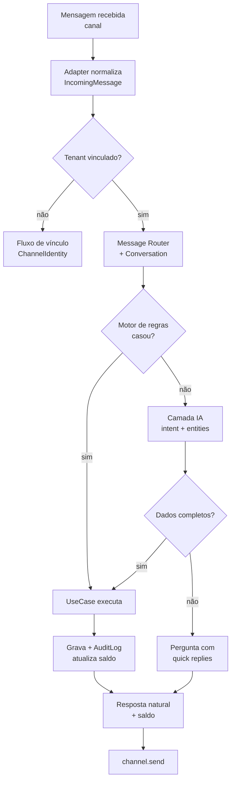
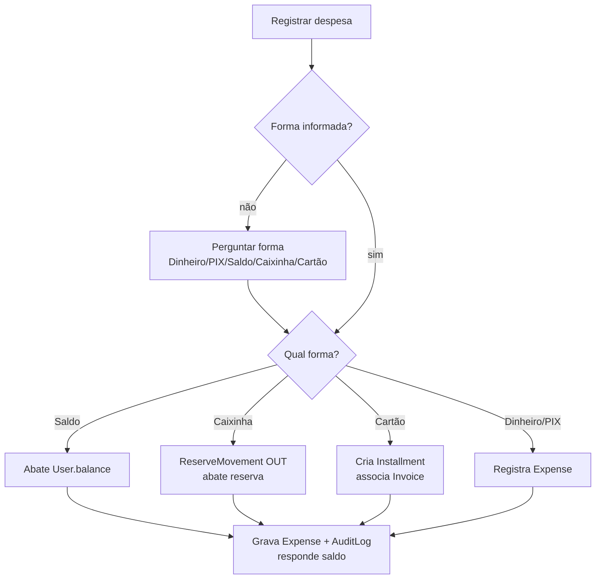
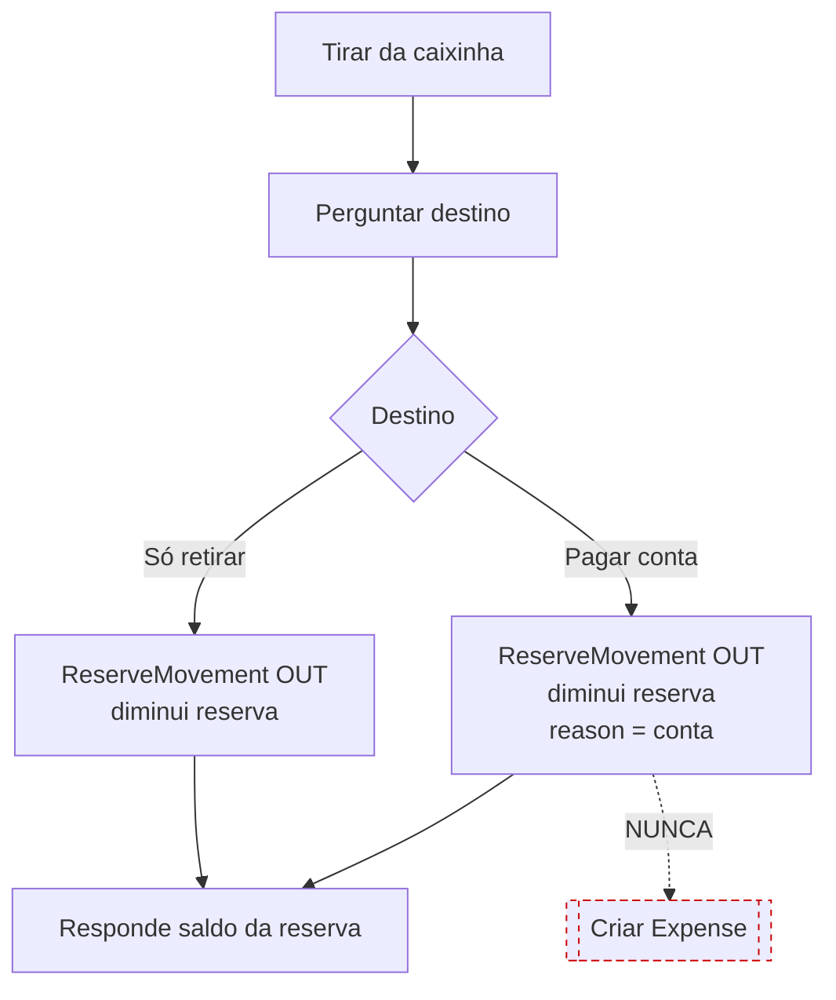
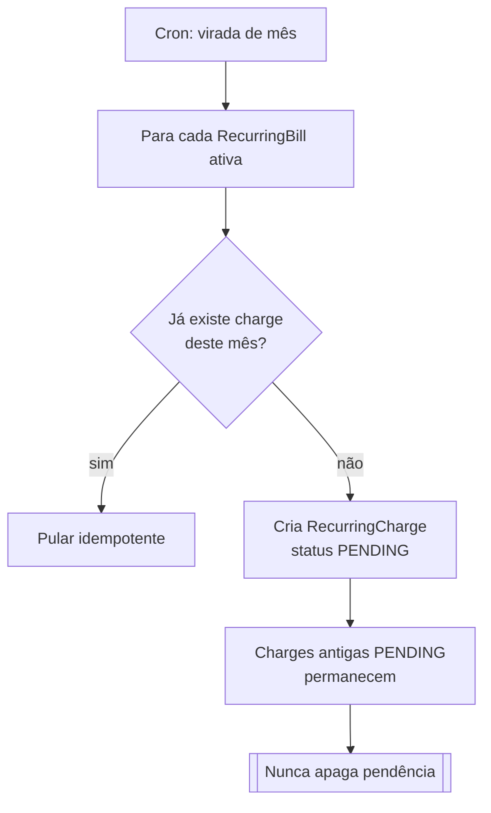
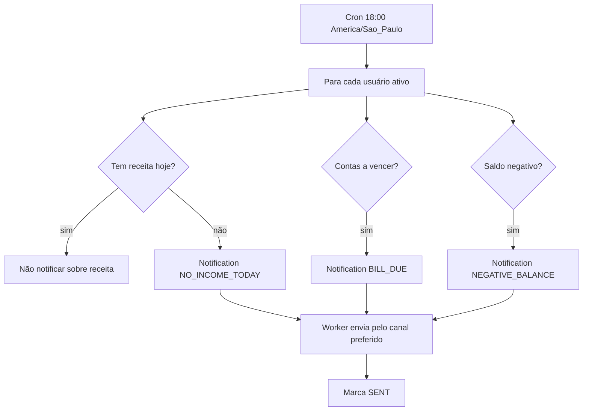

# 14 — Fluxogramas

> Diagramas Mermaid dos fluxos centrais. Renderizam no GitHub/VS Code.

## a) Ciclo de vida de uma mensagem

## b) Despesa por forma de pagamento

## c) Caixinha — retirar

## d) Contas recorrentes — geração mensal

## e) Notificação das 18h

